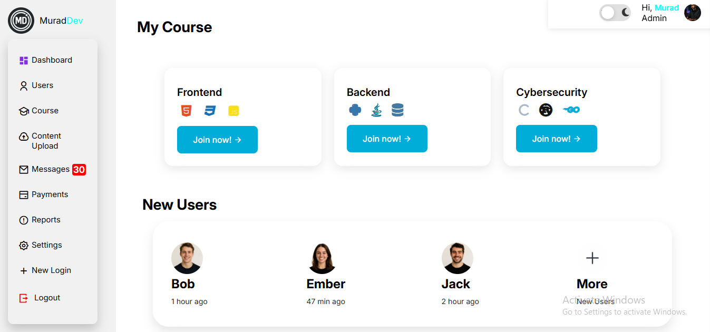
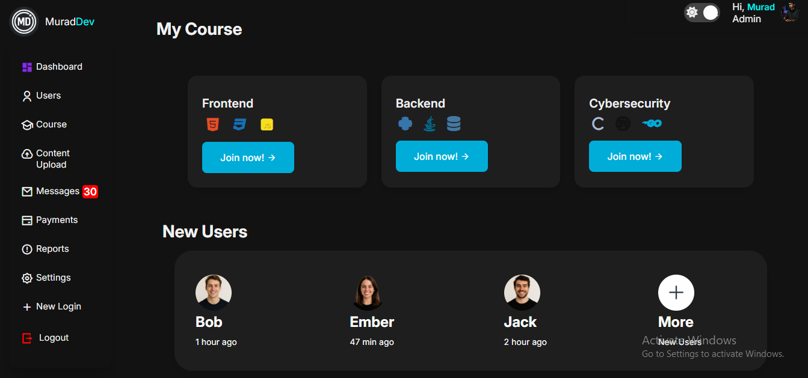

# 💻 Dashboard Website - MuradDev

This project is a modern and responsive **admin dashboard** website made using HTML, CSS and JavaScript. 
The website is designed in the appearance of a real online course platform
and is equipped with course sections in the frontend, backend and cybersecurity areas, a user panel and a dark mode.

## 🔍 Main Features

- 📁 Easy navigation to sections with Sidebar
- 🌙🌞 Light/Dark Mode switching function (with localStorage support)
- 👨‍🎓 Course cards (Frontend, Backend, Cybersecurity)
- 🧑‍💻 Active users section
- 🎨 Beautiful design with colorful and animated icons

## 🧱 Technologies used

- HTML5
- CSS3 (Box Shadow, Grid, Hover effects)
- JavaScript (DOM manipulation, localStorage)
- Remixicon and FontAwesome icon libraries

## 📸 Screenshots

### 🌐 Main Dashboard View

### 🌙 (Dark Mode)

